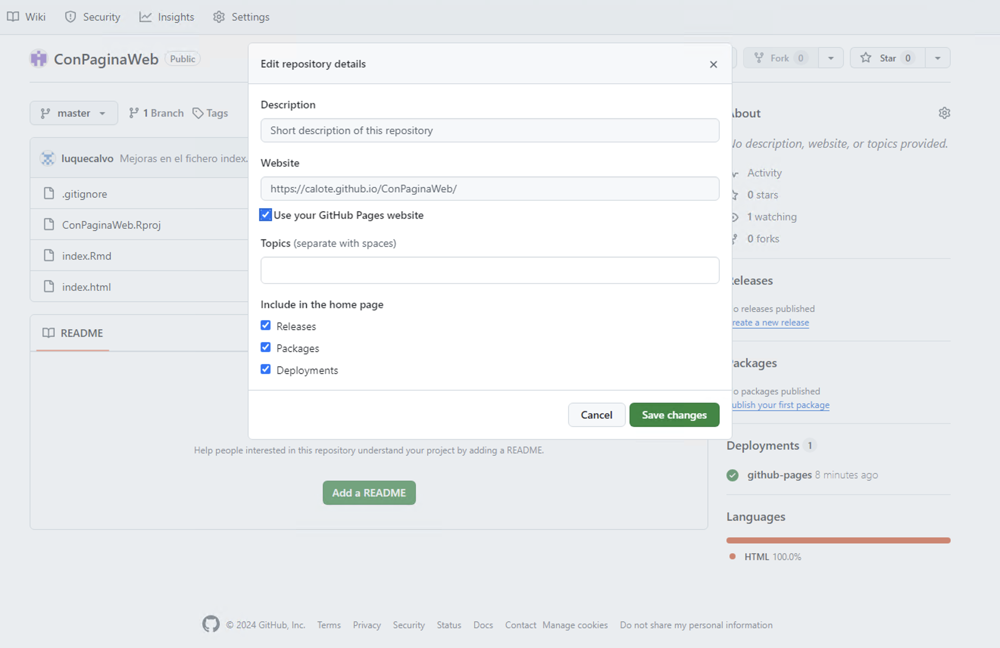

```{r setup, include=FALSE}
knitr::opts_chunk$set(echo = TRUE)
```

# Pasos seguidos para publicar en GitHub con GitHub Pages

-   Crear proyecto RStudio

-   Crear un fichero Rmd llamado: "index.Rmd" pero con formato de salida "html", o un fichero Quarto llamado: "index.qmd".

-   Hacer "Knit" o "Render" sobre el fichero "index.Rmd".

-   Activar el uso de git en el proyecto: `usethis::use_git_config(user.name = "Jane", user.email = "jane@example.org")` y luego: `usethis::use_git()`.

-   Luego activar el uso de GitHub con `usethis::use_github()`.

```         
ℹ Defaulting to "https" Git protocol.
! There are uncommitted changes and we're about to create and push to a new GitHub repo
  Do you want to proceed anyway?

1: No way
2: For sure
3: Nope

Selection: 2
✔ Creating GitHub repository "calote/ConPaginaWeb".
✔ Setting remote "origin" to "https://github.com/calote/ConPaginaWeb.git".
✔ Pushing "master" branch to GitHub and setting "origin/master" as upstream branch.
✔ Opening URL <https://github.com/calote/ConPaginaWeb>.
```

-   Es decir, el repositorio creado en GitHub tiene la siguiente dirección: <https://github.com/calote/ConPaginaWeb>.

-   Hacer un Commit y luego un Push al repositorio en GitHub.

-   En GitHub hago lo siguiente:

    -   En Settings del repositorio busco en su menú de la izquierda: "Pages".

    -   En Source dejo la opción: "Deploy from a branch".

    -   En Rama (o "Branch") selecciono "master" (tal como se llama en RStudio), y en la carpeta dejo "/root" (podría seleccionar otra carpeta donde deberían estar mis ficheros html). Luego pulso sobre **"Save"**.

-   Durará unos instantes en construirse, pero la página web asociada a nuestro repositorio estará disponible en la siguiente dirección web: <https://calote.github.io/ConPaginaWeb>.

    -   El nombre se ha construido con el siguiente formato: **"<https://usuarioGitHub.github.io/nombreRepositorio>"**.

## Comentarios adicionales

-   Se puede hacer clic en la rueda junto al apartado "About" (en la parte derecha del repositorio) y seleccionar: "Use your GitHub Pages website" y pulsar sobre "Save changes".

    

-   Si escribimos la url: <https://calote.github.io/ConPaginaWeb/index.Rmd>, se descargaría el fichero "index.Rmd". Siempre se podría ir al repositorio fuente <https://github.com/calote/ConPaginaWeb> y descargar el fichero "index.Rmd" y cualquiera que este disponible.

-   Más información sobre publicar en GitHub Pages: <https://docs.github.com/es/pages/getting-started-with-github-pages/configuring-a-publishing-source-for-your-github-pages-site>

- Puedo añadir ficheros Rmd o Quarto con salida html y los puedo enlazar desde mi fichero index.Rmd.

    + Por ejemplo, he creado el fichero Quarto: "noticia01.qmd" y su fichero salida sería: "noticia01.html", puedo acceder a su contenido desde este fichero escribiendo un url como la siguiente: [url a noticia01 html](noticia01.html).

## R Markdown

This is an R Markdown document. Markdown is a simple formatting syntax for authoring HTML, PDF, and MS Word documents. For more details on using R Markdown see <http://rmarkdown.rstudio.com>.

When you click the **Knit** button a document will be generated that includes both content as well as the output of any embedded R code chunks within the document. You can embed an R code chunk like this:

```{r cars}
summary(cars)
```

## Including Plots

You can also embed plots, for example:

```{r pressure, echo=FALSE}
plot(pressure)
```

Note that the `echo = FALSE` parameter was added to the code chunk to prevent printing of the R code that generated the plot.
